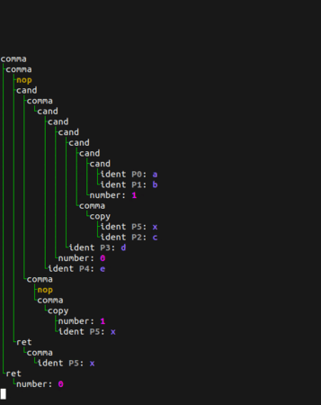
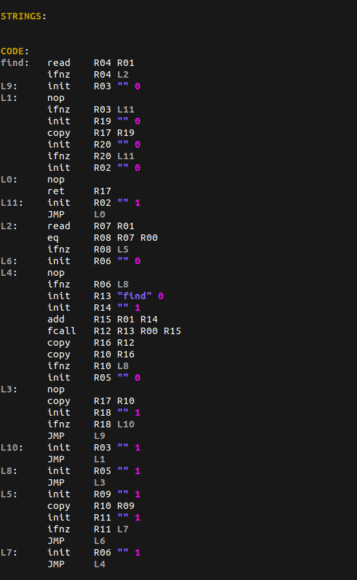

# ParserLALR
This is a python implementation of the LALR(1) algorithm. It allows the generation of efficient parsers through a grammar definition.

This package offers helper classes to create lexers and parsers as well as transformers function to shape a better output.

## Implementation
### Lexers
Lexers are defined as a list of regular expressions. The output of a lexer is a list of tokens with each a type and a value. Here is for example a simple arithmetic lexer:
```py
 class LexerMath(Lexer):
     ENTRIES = ["+", "-", "*", "/", "(", ")"]

     @token("[0-9]+")
     def _(self, val):
         return int(val), "num"

     @token("[ \t\r\n]+")
     def _(self, val):
         pass
```
Simple tokens like `+` and `-` can be defined in `ENTRIES`, they will produce tokens of equal type and value `+` and `-` respectively.

The `@token` decorator can be used to better specify the type and value of a token, or to match a regular expression instead of plain text. If the decorated function returns `None`, the token is ignored.

### Parsers
A parser is primarily a grammar definition.
Given the very simple arithmetic grammar:
```
S = A
A = A+F
  | F
F = F*T
  | T
T = (A)
  | num
```
We differentiate terminals and non-terminals:
```
terminals: S, A, F, T
non-terminals: "+", "*", "(", ")", num
```
And here is how it would be defined in python:
```py
A = NT()
F = NT()
T = NT()
class ParserMath(Parser):
	START = A
	@production(A, "+", F, out=A)
		...
	@production(F, out=A)
		...
	@production(F, "*", T, out=F)
		...
	@production(T, out=F)
		...
	@production("(", A, ")", out=T)
		...
	@production("num", out=T)
		...
```
This is technically enough to say if a string matches or not a grammar. To construct a meaningful output each production rule decorate a transformer function which, given a list of token that matches the rule, returns a value to propagate. The usual output is an AST.
Here is an example:
```py
class ParserMath(Parser):
    START = A
    @production(A, "+", F, out=A)
	def _(left, op, right):
        return {"left":left, "right":right, "op":op}
    @production(F, out=A)
    def _(x):
		return x
    @production(F, "*", T, out=F)
	def _(left, op, right):
        return {"left":left, "right":right, "op":op}
    @production(T, out=F)
    def _(x):
		return x
    @production("(", A, ")", out=T)
    def _(lparen, x, rparen):
		return x
    @production("num", out=T)
    def _(x):
		return x
```

### Runtime
Lexers and Parsers are built at runtime on class definition.

Here is an example on how to use them:
```py
text = "2*(1+3)"
lexer = LexerMath(text)
tokens, error = lexer.tokens()
if error:
    print(error)
	exit()
result, error = ParserMath.parse(tokens, lexer)
if error:
    print(error)
	exit()
print(result)
```
output:
```py
{
	"left": 2,
	"op": "*",
	"right": {
		"left": 1
		"op": "+"
		"right": 3
	}
}
```

## Experiments
With this tools I created some [parsers](grammars). I started with really simple ones, like a JSON to python dict parser. But I quickly wanted to try and make a working programming language.

### WYOOS
[WYOOS](grammars/wyoos) is a very simple interpreted language inspired by the [Write your own Operating System](https://www.youtube.com/channel/UCQdZltW7bh1ta-_nCH7LWYw) YT channel.

### Bisqwit
[Bisqwit](grammars/bisqwit) is a more complete and low level compiled language inspired by the [Bisqwit](https://www.youtube.com/c/Bisqwit) YT channel.

It is by far the most complex and advanced part of this repository and extends way beyond parsing algorithm, into compiling process.

The current process is broken in several steps.

#### Step 1
A plain text file is transformed into an AST (with an LALR parser).

#### Step 2
The AST is simplified and optimised.
Here is a visualisation of this process on the given input:

```
function test(a, b, c, d, e, x) {
    if (a && b && 1 && (c=x) && d && 0 && e) {
        x = 1;
    }
    return x;
}
```



The final output can be rewritten as:
```
function test(a, b, c, d, e, x) {
	a && b && c=x;
	return x;
}
```

#### Step 3
The optimised AST is converted to TAC and optimised again.
Here is a visualisation of this process on the given input:

```
function find(c, s) {
	return *s ? *s==c ? 1 : find(c,s+1) : 0;
}
```



#### Step 4
At this point the code is almost ready to be converted to assembly. This part is still to be written though...
